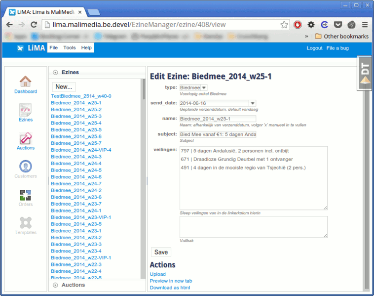

# LiMA

## Introduction

**LiMA** is a recursive acronym and an anagram of "Mali": **L**iMA **i**s **M**ali Media's **A**pplication. It's initial use was to be a central hub for all of Mali Media's dataflows and operations but certain functionalities have since been superceded by other applications or platforms (Odoo ERP, Zendesk, Google DataStudio, Amazon AWS, ...). Today it is only used to make newsletters and upload them to the different emailing-platforms.

**startup: production**

`$ ../bin/pserve production.ini --daemon`

OR

`$ kill $(< pyramid.pid) && ../bin/pserve production.ini --daemon`

## Technologies

- backend written in Python:
	- [Pyramid framework](https://trypyramid.com/)
	- [SQLAlchemy](https://www.sqlalchemy.org/)
	- [PostgreSQL](https://www.postgresql.org/)
- front in [Dojo Toolkit](https://dojotoolkit.org/)

## History

See: [CHANGES.md](./CHANGES.md)
